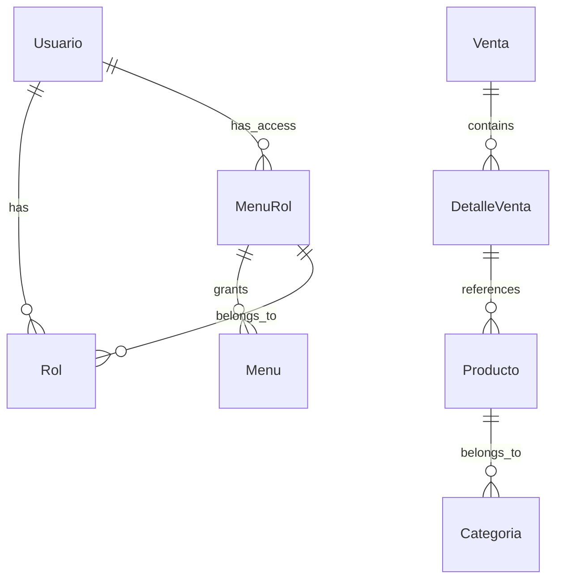

## Overview

Sistema Venta follows a clean, layered architecture pattern that separates concerns and promotes maintainability. The system is divided into a backend API built with .NET 7.0 and a frontend application built with Angular 14.


## Technology Stack

<CardGroup cols={2}>
  <Card title="Backend" icon="server">
    - **.NET 7.0**: Core framework
    - **ASP.NET Core Web API**: RESTful API
    - **Entity Framework Core**: ORM
    - **SQL Server**: Database
    - **AutoMapper**: Object mapping
    - **Swagger/OpenAPI**: API documentation
  </Card>
  <Card title="Frontend" icon="window">
    - **Angular 14**: Frontend framework
    - **Angular Material**: UI components
    - **RxJS**: Reactive programming
    - **Chart.js**: Data visualization
    - **SweetAlert2**: User notifications
    - **XLSX**: Excel export functionality
  </Card>
</CardGroup>

## Backend Architecture

The backend follows a **6-layer architecture** that ensures separation of concerns and maintainability:

### 1. API Layer (SistemaVenta.API)

The presentation layer that exposes RESTful endpoints to the frontend.

**Key Components:**
- **Controllers**: Handle HTTP requests and responses
- **Program.cs**: Application entry point and middleware configuration
- **Response Utility**: Standardized API response format

```csharp Program.cs
using SistemaVenta.IOC;

var builder = WebApplication.CreateBuilder(args);

builder.Services.AddControllers();
builder.Services.AddEndpointsApiExplorer();
builder.Services.AddSwaggerGen();

// Dependency injection configuration
builder.Services.InyectarDependencias(builder.Configuration);

// CORS policy for frontend
builder.Services.AddCors(options => {
    options.AddPolicy("NuevaPolitica", app => {
        app.AllowAnyOrigin()
           .AllowAnyHeader()
           .AllowAnyMethod();
    });
});

var app = builder.Build();

if (app.Environment.IsDevelopment())
{
    app.UseSwagger();
    app.UseSwaggerUI();
}

app.UseCors("NuevaPolitica");
app.UseAuthorization();
app.MapControllers();

app.Run();
```

**Example Controller:**

```csharp VentaController.cs
[Route("api/[controller]")]
[ApiController]
public class VentaController : ControllerBase
{
    private readonly IVentaService _ventaServicio;

    public VentaController(IVentaService ventaServicio)
    {
        _ventaServicio = ventaServicio;
    }

    [HttpPost]
    [Route("Registrar")]
    public async Task<IActionResult> Registrar([FromBody] VentaDTO venta)
    {
        var rsp = new Response<VentaDTO>();
        try
        {
            rsp.status = true;
            rsp.value = await _ventaServicio.Registrar(venta);
        }
        catch (Exception ex)
        {
            rsp.status = false;
            rsp.msg = ex.Message;
        }
        return Ok(rsp);
    }

    [HttpGet]
    [Route("Historial")]
    public async Task<IActionResult> Historial(
        string buscarPor, 
        string? numeroVenta, 
        string? fechaInicio, 
        string? fechaFin)
    {
        var rsp = new Response<List<VentaDTO>>();
        numeroVenta = numeroVenta ?? "";
        fechaInicio = fechaInicio ?? "";
        fechaFin = fechaFin ?? "";

        try
        {
            rsp.status = true;
            rsp.value = await _ventaServicio.Historial(
                buscarPor, numeroVenta, fechaInicio, fechaFin);
        }
        catch (Exception ex)
        {
            rsp.status = false;
            rsp.msg = ex.Message;
        }
        return Ok(rsp);
    }
}
```

### 2. Business Logic Layer (SistemaVenta.BLL)

Contains the business rules and application logic.

**Responsibilities:**
- Implement business rules and validation
- Orchestrate data flow between layers
- Transform entities to DTOs using AutoMapper
- Handle complex business operations

**Service Structure:**

```csharp VentaService.cs
public class VentaService : IVentaService
{
    private readonly IVentaRepository _ventaRepositorio;
    private readonly IGenericRepository<DetalleVenta> _detalleVentaRepositorio;
    private readonly IMapper _mapper;

    public VentaService(
        IVentaRepository ventaRepositorio,
        IGenericRepository<DetalleVenta> detalleVentaRepositorio,
        IMapper mapper)
    {
        _ventaRepositorio = ventaRepositorio;
        _detalleVentaRepositorio = detalleVentaRepositorio;
        _mapper = mapper;
    }

    public async Task<VentaDTO> Registrar(VentaDTO modelo)
    {
        try
        {
            var ventaGenerada = await _ventaRepositorio.Registrar(
                _mapper.Map<Venta>(modelo));

            if(ventaGenerada.IdVenta == 0)
                throw new TaskCanceledException("No se pudo crear");

            return _mapper.Map<VentaDTO>(ventaGenerada);
        }
        catch
        {
            throw;
        }
    }

    public async Task<List<VentaDTO>> Historial(
        string buscarPor, 
        string numeroVenta, 
        string fechaInicio, 
        string fechaFin)
    {
        IQueryable<Venta> query = await _ventaRepositorio.Consultar();
        var ListaResultado = new List<Venta>();

        try
        {
            if (buscarPor == "fecha")
            {
                DateTime fech_Inicio = DateTime.ParseExact(
                    fechaInicio, "dd/MM/yyyy", new CultureInfo("es-PE"));
                DateTime fech_Fin = DateTime.ParseExact(
                    fechaFin, "dd/MM/yyyy", new CultureInfo("es-PE"));

                ListaResultado = await query
                    .Where(v => v.FechaRegistro.Value.Date >= fech_Inicio.Date &&
                                v.FechaRegistro.Value.Date <= fech_Fin.Date)
                    .Include(dv => dv.DetalleVenta)
                    .ThenInclude(p => p.IdProductoNavigation)
                    .ToListAsync();
            }
            else
            {
                ListaResultado = await query
                    .Where(v => v.NumeroDocumento == numeroVenta)
                    .Include(dv => dv.DetalleVenta)
                    .ThenInclude(p => p.IdProductoNavigation)
                    .ToListAsync();
            }
        }
        catch
        {
            throw;
        }

        return _mapper.Map<List<VentaDTO>>(ListaResultado);
    }
}
```

**Service Contracts:**

```csharp Services Available
- IRolService: Role management
- IUsuarioService: User authentication and management
- ICategoriaService: Category CRUD operations
- IProductoService: Product catalog management
- IVentaService: Sales transaction processing
- IDashBoardService: Dashboard analytics and KPIs
- IMenuService: Dynamic menu generation based on roles
```

### 3. Data Access Layer (SistemaVenta.DAL)

Handles all database operations through repositories.

**Key Components:**
- **DbContext**: Entity Framework context
- **Generic Repository**: CRUD operations for all entities
- **Specialized Repositories**: Custom queries for complex operations

**Generic Repository Pattern:**

```csharp GenericRepository.cs
public class GenericRepository<TModelo> : IGenericRepository<TModelo> 
    where TModelo : class
{
    private readonly DbventaContext _dbcontext;

    public GenericRepository(DbventaContext dbcontext)
    {
        _dbcontext = dbcontext;
    }

    public async Task<TModelo> Obtener(Expression<Func<TModelo, bool>> filtro)
    {
        try
        {
            TModelo modelo = await _dbcontext.Set<TModelo>()
                .FirstOrDefaultAsync(filtro);
            return modelo;
        }
        catch
        {
            throw;
        }
    }

    public async Task<TModelo> Crear(TModelo modelo)
    {
        try
        {
            _dbcontext.Set<TModelo>().Add(modelo);
            await _dbcontext.SaveChangesAsync();
            return modelo;
        }
        catch
        {
            throw;
        }
    }

    public async Task<bool> Editar(TModelo modelo)
    {
        try
        {
            _dbcontext.Set<TModelo>().Update(modelo);
            await _dbcontext.SaveChangesAsync();
            return true;
        }
        catch
        {
            throw;
        }
    }

    public async Task<bool> Eliminar(TModelo modelo)
    {
        try
        {
            _dbcontext.Set<TModelo>().Remove(modelo);
            await _dbcontext.SaveChangesAsync();
            return true;
        }
        catch
        {
            throw;
        }
    }

    public async Task<IQueryable<TModelo>> Consultar(
        Expression<Func<TModelo, bool>> filtro = null)
    {
        try
        {
            IQueryable<TModelo> queryModelo = filtro == null 
                ? _dbcontext.Set<TModelo>() 
                : _dbcontext.Set<TModelo>().Where(filtro);
            return queryModelo;
        }
        catch
        {
            throw;
        }
    }
}
```

**Database Context:**

```csharp DbventaContext.cs
public partial class DbventaContext : DbContext
{
    public DbventaContext(DbContextOptions<DbventaContext> options)
        : base(options)
    {
    }

    // DbSets for all entities
    public virtual DbSet<Categoria> Categoria { get; set; }
    public virtual DbSet<DetalleVenta> DetalleVenta { get; set; }
    public virtual DbSet<Menu> Menus { get; set; }
    public virtual DbSet<MenuRol> MenuRols { get; set; }
    public virtual DbSet<NumeroDocumento> NumeroDocumentos { get; set; }
    public virtual DbSet<Producto> Productos { get; set; }
    public virtual DbSet<Rol> Rols { get; set; }
    public virtual DbSet<Usuario> Usuarios { get; set; }
    public virtual DbSet<Venta> Venta { get; set; }

    protected override void OnModelCreating(ModelBuilder modelBuilder)
    {
        // Entity configurations
        // Relationships, constraints, and column mappings
    }
}
```

### 4. Model Layer (SistemaVenta.Model)

Contains Entity Framework Core entity classes that map to database tables.

**Core Entities:**

```csharp Entity Examples
- Categoria: Product categories (IdCategoria, Nombre, EsActivo, FechaRegistro)
- Producto: Products (IdProducto, Nombre, IdCategoria, Stock, Precio, EsActivo)
- Venta: Sales (IdVenta, NumeroDocumento, TipoPago, Total, FechaRegistro)
- DetalleVenta: Sale line items (IdDetalleVenta, IdVenta, IdProducto, Cantidad, Precio, Total)
- Usuario: Users (IdUsuario, NombreCompleto, Correo, Clave, IdRol, EsActivo)
- Rol: User roles (IdRol, Nombre, FechaRegistro)
- Menu: Menu items (IdMenu, Nombre, Icono, Url)
- MenuRol: Menu-Role mapping (IdMenuRol, IdMenu, IdRol)
- NumeroDocumento: Document number sequence (IdNumeroDocumento, UltimoNumero)
```

### 5. DTO Layer (SistemaVenta.DTO)

Data Transfer Objects used for communication between layers and with the frontend.

**DTO Purpose:**
- Decouple internal models from API contracts
- Control data exposure to clients
- Add computed properties
- Format data for display (e.g., decimal to string with culture)

```csharp DTO Examples
CategoriaDTO, ProductoDTO, VentaDTO, DetalleVentaDTO, 
UsuarioDTO, RolDTO, MenuDTO, DashBoardDTO, ReporteDTO, 
LoginDTO, SesionDTO
```

### 6. IOC Layer (SistemaVenta.IOC)

Inversion of Control container configuration for dependency injection.

```csharp Dependencia.cs
public static class Dependencia
{
    public static void InyectarDependencias(
        this IServiceCollection services, 
        IConfiguration configuration)
    {
        // Database context
        services.AddDbContext<DbventaContext>(options => {
            options.UseSqlServer(
                configuration.GetConnectionString("cadenaSQL"));
        });

        // Repository registration
        services.AddTransient(
            typeof(IGenericRepository<>), 
            typeof(GenericRepository<>));
        services.AddScoped<IVentaRepository, VentaRepository>();

        // AutoMapper configuration
        services.AddAutoMapper(typeof(AutoMapperProfile));

        // Service registration
        services.AddScoped<IRolService, RolService>();
        services.AddScoped<IUsuarioService, UsuarioService>();
        services.AddScoped<ICategoriaService, CategoriaService>();
        services.AddScoped<IProductoService, ProductoService>();
        services.AddScoped<IVentaService, VentaService>();
        services.AddScoped<IDashBoardService, DashBoardService>();
        services.AddScoped<IMenuService, MenuService>();
    }
}
```

### 7. Utility Layer (SistemaVenta.Utility)

Shared utilities and cross-cutting concerns.

**AutoMapper Configuration:**

```csharp AutoMapperProfile.cs
public class AutoMapperProfile : Profile
{
    public AutoMapperProfile()
    {
        // Rol mapping
        CreateMap<Rol, RolDTO>().ReverseMap();

        // Usuario mapping with computed properties
        CreateMap<Usuario, UsuarioDTO>()
            .ForMember(destino => destino.RolDescripcion,
                opt => opt.MapFrom(origen => origen.IdRolNavigation.Nombre))
            .ForMember(destino => destino.EsActivo,
                opt => opt.MapFrom(origen => origen.EsActivo == true ? 1 : 0));

        // Producto mapping with culture-specific formatting
        CreateMap<Producto, ProductoDTO>()
            .ForMember(destino => destino.DescripcionCategoria,
                opt => opt.MapFrom(origen => origen.IdCategoriaNavigation.Nombre))
            .ForMember(destino => destino.Precio,
                opt => opt.MapFrom(origen => 
                    Convert.ToString(origen.Precio.Value, 
                        new CultureInfo("es-PE"))));

        // Additional mappings for Venta, DetalleVenta, etc.
    }
}
```

## Frontend Architecture

The Angular application follows a modular, component-based architecture:

### Project Structure

```
AppSistemaVenta/
├── src/
│   ├── app/
│   │   ├── components/      # Reusable UI components
│   │   ├── pages/          # Feature pages/modules
│   │   ├── services/       # API communication services
│   │   ├── models/         # TypeScript interfaces
│   │   ├── guards/         # Route guards for auth
│   │   └── interceptors/   # HTTP interceptors
│   ├── assets/            # Static assets
│   └── environments/      # Environment configs
```

### Key Technologies

**Angular Material**: Provides a comprehensive UI component library following Material Design principles.

**RxJS**: Used for reactive programming with Observables for async operations:

```typescript Example Service
import { Injectable } from '@angular/core';
import { HttpClient } from '@angular/common/http';
import { Observable } from 'rxjs';
import { environment } from '../environments/environment';

@Injectable({
  providedIn: 'root'
})
export class VentaService {
  private apiUrl = `${environment.apiUrl}/Venta`;

  constructor(private http: HttpClient) { }

  registrar(venta: Venta): Observable<Response<Venta>> {
    return this.http.post<Response<Venta>>(
      `${this.apiUrl}/Registrar`, venta);
  }

  historial(params: HistorialParams): Observable<Response<Venta[]>> {
    return this.http.get<Response<Venta[]>>(
      `${this.apiUrl}/Historial`, { params });
  }
}
```

**Chart.js**: Dashboard visualizations for sales metrics and analytics.

**XLSX Library**: Export sales reports and data to Excel format.

## Data Flow

A typical request flows through the system as follows:

<Steps>
  <Step title="Client Request">
    Angular component initiates an HTTP request through a service
  </Step>

  <Step title="API Controller">
    ASP.NET Core controller receives the request and validates input
  </Step>

  <Step title="Business Logic">
    Controller invokes the appropriate service method from the BLL
  </Step>

  <Step title="Data Access">
    Service calls repository methods to query/modify data
  </Step>

  <Step title="Database Operation">
    Entity Framework executes SQL queries against SQL Server
  </Step>

  <Step title="Mapping">
    AutoMapper converts entities to DTOs
  </Step>

  <Step title="Response">
    Controller returns standardized Response&lt;T&gt; object to client
  </Step>

  <Step title="UI Update">
    Angular component updates the view with the response data
  </Step>
</Steps>

## Security Considerations

<Warning>
  The current implementation includes basic CORS configuration. For production deployments, you should:
  
  1. Implement proper authentication (JWT, OAuth, etc.)
  2. Add authorization policies for role-based access
  3. Configure CORS to allow only specific origins
  4. Enable HTTPS in production
  5. Implement input validation and sanitization
  6. Add rate limiting and request throttling
  7. Use environment-specific configuration
</Warning>

## Design Patterns

Sistema Venta implements several design patterns:

<CardGroup cols={2}>
  <Card title="Repository Pattern" icon="database">
    Abstracts data access logic with `IGenericRepository<T>` and specialized repositories
  </Card>
  <Card title="Dependency Injection" icon="plug">
    All dependencies are injected through constructors, configured in the IOC layer
  </Card>
  <Card title="Service Layer Pattern" icon="layer-group">
    Business logic is encapsulated in service classes, keeping controllers thin
  </Card>
  <Card title="DTO Pattern" icon="exchange">
    Separates internal models from API contracts using Data Transfer Objects
  </Card>
</CardGroup>

## Database Schema

The database uses a relational model with the following key relationships:



**Key Relationships:**
- Users belong to Roles (many-to-one)
- Products belong to Categories (many-to-one)
- Sales contain multiple DetalleVenta (one-to-many)
- DetalleVenta references Products (many-to-one)
- Roles have access to Menus through MenuRol (many-to-many)

## Performance Considerations

<Note>
  **Optimization Strategies:**
  
  - **Async/Await**: All database operations use async methods
  - **IQueryable**: Queries are built and executed efficiently with deferred execution
  - **Include/ThenInclude**: Eager loading to prevent N+1 query problems
  - **Generic Repository**: Reusable data access patterns reduce code duplication
  - **AutoMapper**: Efficient object mapping with cached reflection
  - **Connection Pooling**: SQL Server connection pooling is enabled by default
</Note>

## Scalability

The layered architecture supports horizontal and vertical scaling:

- **Stateless API**: Controllers are stateless, enabling load balancing
- **Repository Pattern**: Easy to swap implementations (e.g., caching layer)
- **Service Layer**: Business logic can be extracted to separate microservices
- **Angular SPA**: Frontend is decoupled and can be hosted separately

## Next Steps

<CardGroup cols={2}>
  <Card title="API Endpoints" icon="code" href="/api/auth/login">
    Explore detailed API documentation for all endpoints
  </Card>
  <Card title="Database Schema" icon="database" href="/backend/database">
    View complete database schema and entity relationships
  </Card>
  <Card title="Frontend Setup" icon="window" href="/frontend/configuration">
    Learn about Angular components and services
  </Card>
  <Card title="Deployment" icon="rocket" href="/backend/deployment">
    Deploy Sistema Venta to production environments
  </Card>
</CardGroup>
